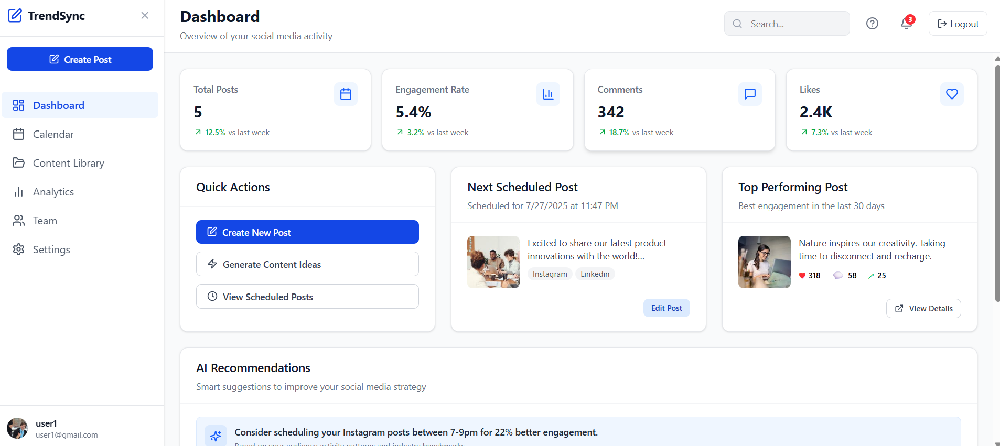

# 🚀 TrendSync – Social Media Content Scheduler

**TrendSync** is a powerful full-stack application that simplifies content planning and scheduling across social media platforms. Whether you're a content creator, brand, or digital team, TrendSync helps you streamline your workflow with:

- 🔐 Social login and secure authentication
- 🗓️ Visual content calendar
- 🖼️ Media asset management
- 🤖 (Coming Soon) AI-powered captions and hashtags
- 📊 Engagement analytics

Built with the **MERN Stack** — MongoDB, Express.js, React, and Node.js.

---

## 🧩 Tech Stack

| Layer       | Tech Stack                                  |
|-------------|----------------------------------------------|
| Frontend    | React, Tailwind CSS, Vite                   |
| Backend     | Node.js, Express                            |
| Database    | MongoDB                                     |
| Auth        | JWT, Passport.js, OAuth (Google, Facebook)  |
| Deployment  | Render(https://trendsync0.onrender.com)   |

---

## ✨ Features

- ✅ JWT & OAuth Authentication (Google, Facebook)
- ✅ Media Library with tag-based filtering
- ✅ Calendar View with mini-post previews
- ✅ Create, schedule, and manage posts
- ✅ Team collaboration (in progress)
- ✅ Analytics dashboard (coming soon)

---

## 🚀 Getting Started

Follow these steps to set up the project locally.

---

### 🧾 Prerequisites

Ensure the following are installed on your machine:

- [Node.js](https://nodejs.org/) (v16+)
- [npm](https://www.npmjs.com/)
- [MongoDB](https://www.mongodb.com/) (local or Atlas)

---

### 1️⃣ Clone the Repository

```bash
git clone https://github.com/jollyhub8278/TrendSync.git
cd TrendSync
```


### 2️⃣ Install Root Dependencies 

```bash
npm install
```

### 3️⃣ Frontend Setup

```bash
cd client
npm install
npm run dev
```

### 4️⃣ Backend Setup

```bash
cd client
npm install
npm run dev
```

### 5️⃣ Environment Configuration

```env
MONGO_URI=mongodb://<DB_HOST>:<DB_PORT>/<DB_NAME>
JWT_SECRET=your_jwt_secret
PORT=5000
```

---

### 🎨 UI Preview





